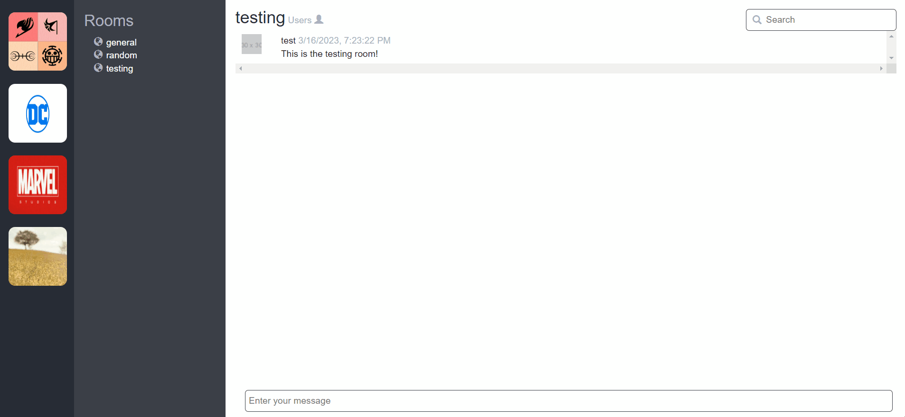

# A Slack Clone (WIP)

As the name implies, this is a chat/messenger app similar to Slack or Discord.

## How It's Made:

**Dependencies used:** bcrypt, body-parser, connect-mongo, dotenv, ejs, express-flash, express-session, express, mongodb, mongoose, nodemon, passport-local, passport, socket.io, validator

### Features 

* Create a user account
* Navigate between and join/subscribe to different chat rooms
* Store message/room history
* Send new messages in real-time and broadcast them to subscribed users

### Using Socket.io

We initialize an instance of `socket.io` by passing it our Express server object. This allows our server to listen to and events emitted by our frontend clients in real-time, as well as send events to clients in real-time. 

On the frontend, we have our client JS script make a connection to our server via `socket.io`. We can now say that a socket is connected to our server. 

#### Namespace and room hierarchy

`socket.io` includes two frameworks for organization that I am using in my project: namespaces and rooms.

Users can join/subscribe to rooms and send messages to them. Users in a room can view all of the messages ever sent in this room. Users in the room can also see the message history update in real-time whenever a new message is sent by others to this room. 

Namespaces contain a collection of rooms and are distinct from other namespaces. 

Slack and Discord use this same hierarchy to organize their conversations. 

#### Routing users to different namespaces and rooms

_[Backend begins here]_

Once the server starts up, `socket.io` is used to look out for clients connecting to each namespace. We can liken this to "event listeners" that are used in traditional frontend Javascript.

While this project currently has some logic that iterates through some test namepsaces and sets up this event listener for each of them, there is currently only one main namespace with any real code/data associated with it. The other namespaces are non-functional (and actually break the server if any user interacts with it). I have plans on expanding to multi-namespace functionality in the future. 

_[Frontend begins here]_

Once the namespace loads up in the client, users will see a list of rooms that they can click through. Clicking on a room will route them to a separate webpage for that specific room. 

_[Backend begins here]_

The server is set up with Express routing for these page visits and captures the room name via URL query parameter. With the room name captured, the server connects the user's socket to the underlying "room" entity. Now, this user will receive all real-time events emitted to that room by the server. The main event that users receive at this point in the project's lifetime are new messages in a room. 

The server pulls all of the message history for the requested room from our database and uses it to populate the eventual `.ejs` file that is served to the client.

#### Sending messages

_[Frontend begins here]_

Users utilize an HTML form element to compose their messages. On submit, the client emits an event called `newMessageToServer` via the existing socket connection to the server. The new message is added to the DOM for the sending user via the client-side Javascript.

_[Backend begins here]_

The server is always listening for these `newMessageToServer` events. Once it hears this event fire off from the client, the server grabs information about the message and its sending user (e.g. username, room name, message text, timestamp of the message send event) and saves it to our `messages` collection in our database.

The server then emits this same message/user information via an event called `messageToClients` to all other clients/sockets that are connected to the room in question. 

_[Frontend begins here]_

All clients connected to a room are listening for this `messageToClients` event. Once a client hears this event, it takes the accompanying message/user information and adds it to the DOM. 

### HTML templates

To facilitate the serving of personalized views, I'm using `ejs` to create HTML templates populated with user-specific information.

### DB

I'm using MongoDB to store data. Mongoose is being used to intialize and interact with the DB.

### Auth

The other key tool that is helping serve customized views is authorization.

* This project uses [passport.js](https://www.passportjs.org/packages/passport-local/) to manage user account creation. I'm using passport's `passport-local` strategy, which requires an email address and password for auth. 
  * Passwords are hashed via `bcrypt`.
  * User entities are saved to the DB.
* Email address and password fields on the website have basic validation via [validatorjs](https://github.com/validatorjs/validator.js).
  * Basic temporary validation errors appear on the login and signup pages using `express-flash`.
* Sessions are saved to DB using `express-session`.

## Lessons Learned:

* socket.io is a powerful tool that is used for real-time data exchange. For this reason, it is often used as the backbone of chat/messenger apps.
* I learned how to incorporate the socket-related code in my currently used MVC model of code organization

## Opportunities

* Rewrite client-side code using React
* Use unique user IDs in both the client- and server-side operations (e.g. when sending messages) 
* Encapuslate socket event handlers in custom API methods 
* Track and show "active/online" users in the client
* Keyword search for messages in the client
* Capabiliity to create new rooms and namespaces from the client
* Add/update user profile picture from the client
* Set active or default room on page load
* Fix bug where scroll position doesn't update when a client receives a new message

## Acknowledgements

* [Daniel Atuma](https://danielatuma.medium.com/learn-about-websockets-and-socket-io-build-a-simple-slack-clone-node-js-part-1-6ff4ecca3323) - I used their tutorial in the beginning stages of this project
* [Anton Räihä](https://github.com/avrj/slack-clone) - I used their existing codebase as inspiration for my own organization of code